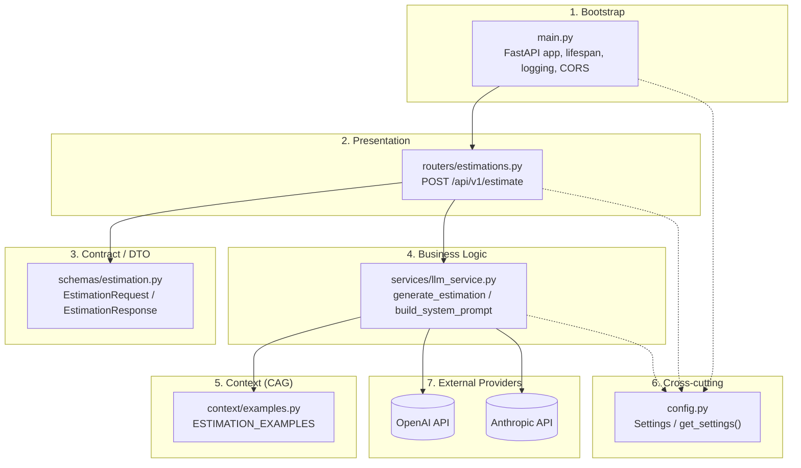
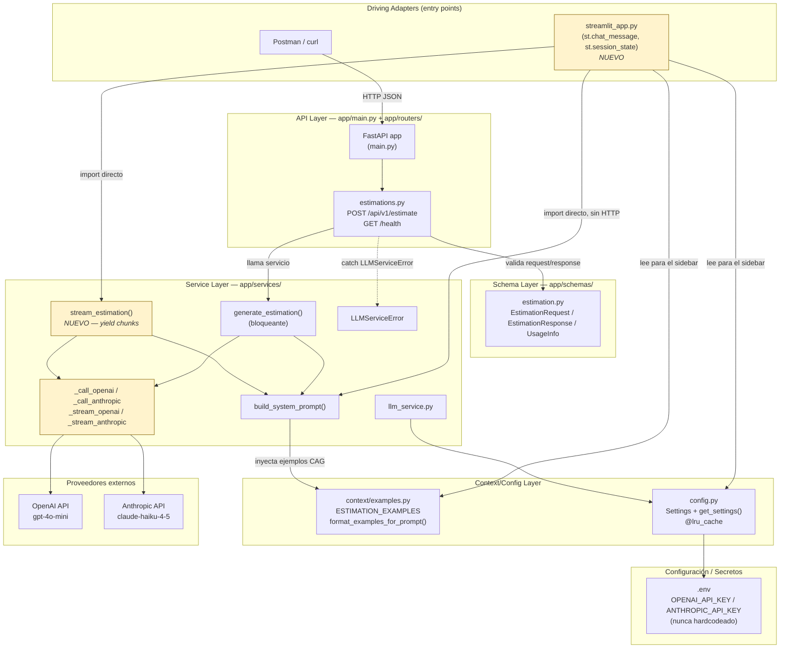

# Estimator CAG - Servicio de Estimacion de Software con IA

Servicio de estimacion de proyectos de software impulsado por IA, utilizando una arquitectura **Cache Augmented Generation (CAG)**.

## Que es CAG y por que lo usamos

CAG (Cache Augmented Generation) es un patron de arquitectura donde el contexto relevante se inyecta directamente en el prompt del LLM como texto estatico. En esta fase del proyecto, las estimaciones de referencia se incluyen como ejemplos dentro del prompt del sistema, sin necesidad de una base de datos vectorial ni busqueda semantica.

Este enfoque es ideal para empezar porque:
- Es simple de implementar y depurar
- No requiere infraestructura adicional (ni embeddings, ni vector stores)
- Funciona bien cuando el volumen de contexto es manejable (pocos ejemplos)

En modulos posteriores del master, este servicio evolucionara a una arquitectura **RAG** (Retrieval Augmented Generation) con base de datos vectorial para manejar un volumen mayor de ejemplos.

## Requisitos previos

- **Docker** y **Docker Compose** instalados
- Una **API key** de OpenAI o Anthropic
- Python **NO** es necesario localmente — todo se ejecuta dentro del contenedor

## Inicio rapido con Docker (recomendado)

1. Clonar el repositorio y entrar al directorio:
   ```bash
   cd estimator
   ```

2. Copiar el archivo de variables de entorno y configurar las API keys:
   ```bash
   cp .env.example .env
   # Editar .env y poner tu API key real
   ```

3. Construir y levantar el servicio:
   ```bash
   docker compose up --build
   ```

4. El servicio estara disponible en `http://localhost:8000`

## Alternativa: ejecucion local sin Docker

```bash
uv sync
# Configurar .env con tus API keys
uv run uvicorn app.main:app --reload
```

## Probar el servicio

```bash
curl -X POST http://localhost:8000/api/v1/estimate \
  -H "Content-Type: application/json" \
  -d '{
    "transcription": "The client wants to build a mobile app for managing restaurant reservations. They need user registration, a restaurant search with filters by cuisine and location, a real-time reservation system with availability checking, push notifications for reservation confirmations and reminders, and an admin panel for restaurant owners to manage their listings and view analytics."
  }'
```

## Estructura del proyecto

```
estimator/
├── app/
│   ├── main.py            # Aplicacion FastAPI, health check, CORS
│   ├── config.py           # Configuracion con Pydantic Settings
│   ├── routers/
│   │   └── estimations.py  # Endpoint POST /api/v1/estimate
│   ├── services/
│   │   └── llm_service.py  # Logica de negocio, llamadas al LLM
│   ├── schemas/
│   │   └── estimation.py   # Modelos Pydantic (request/response)
│   └── context/
│       └── examples.py     # Ejemplos de estimacion (contexto CAG)
├── tests/
│   └── test_health.py      # Tests basicos
├── Dockerfile              # Build multi-stage con uv
├── docker-compose.yml      # Configuracion para desarrollo local
└── pyproject.toml          # Dependencias y configuracion
```

## Documentacion interactiva

Con el servicio corriendo, accede a la documentacion Swagger UI en:

- **Swagger UI:** [http://localhost:8000/docs](http://localhost:8000/docs)
- **ReDoc:** [http://localhost:8000/redoc](http://localhost:8000/redoc)

---

> Este proyecto forma parte del **Master en AI Engineering** y servira como base para evolucionar hacia una arquitectura RAG con base de datos vectorial en modulos posteriores.

## Arquitectura

Este proyecto sigue una arquitectura en capas (Layered Architecture) con un patrón CAG (Context Augmented Generation) en la capa de negocio.


## Versión añadiendo Streamlit



Puntos clave del diagrama:

streamlit_app.py es un nuevo adapter de entrada (igual que Postman/curl vía FastAPI), pero en lugar de pasar por HTTP importa directamente las funciones de llm_service.py — coherente con la arquitectura por capas, sin necesidad de un puerto/adapter formal.
build_system_prompt() se reutiliza sin cambios en ambos flujos (FastAPI y Streamlit) — cumple el requisito "mismo system prompt que el endpoint CAG".
stream_estimation() es la única pieza nueva en la capa de servicio: un generador que hace yield de chunks, usado solo por Streamlit (FastAPI sigue usando la versión bloqueante generate_estimation()).
config.py/.env siguen siendo el único punto de verdad para las API keys — tanto FastAPI como Streamlit leen get_settings(), nunca hardcodean la key.
El sidebar de Streamlit (requisito 3) lee directamente de context/examples.py y config.py, sin pasar por la capa de servicio.